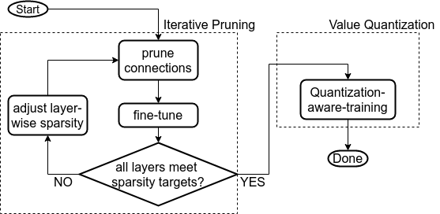

#Micro-range Clustered Bank Balanced Sparsity Training
##About
This repository contains the CNN pruning and quantization code for our FPL2021 paper, 
**Leveraging Fine-grained Structured Sparsity for CNN Inference on Systolic Array Architectures**.

The overall pruning-quantization flow is illustrated below:


If you are looking for the accelerator source code, please visit
the [companion repository](https://github.com/mustard-seed/SparseDNNAccelerator).
##Installation
0. Make sure Anaconda is installed. This repository uses Anaconda 4.8.3.
1. Clone this repository
2. Run setup_environment.sh

##File Organization
```
.
├── conda_environment.yml
├── develop
│   ├── CifarResNet56Experiment.py      # ResNet-56 pruning and quantization on CIFAR-10. Derived from the base experiment class. Not up-to-date.
│   ├── custom_modules                  # Layers with quantization support.
│   ├── custom_qat                      # Custom quantization-aware training layers.
│   ├── experiment                      # Implementation of the base experiment class.
│   ├── ImagenetResNet50Experiment.py   # ResNet-50 v1.5 modification, pruning, quantization, and export. Derived from the base experiment class. 
│   ├── ImagenetVGG16Experiment.py      # VGG-16 pruning, quantization, and export. Derived from the base experiment class. 
│   ├── LeNetExperiment.py              # LeNet pruning, quantization, and export. Derived from the base experiment class. 
│   ├── pruning                         # MCBBS pruning utilities and extension to PyTorch v1.6's pruning.
│   ├── quantization                    # Quantization extensions to PyTorch v1.6
│   ├── resnet50_sweep                  # Experiment configuration files for ResNet-50 v1.5
│   ├── run.sh                          # Script for running experiment on a distributed CPU cluster. Internal use only.
│   ├── testTracer.py                   # Test script for the model exporter.
│   ├── tracer                          # Model exporter
│   ├── utils                           # Miscellaneous utilities
│   └── vgg16_sweep                     # Experiment configuration files for VGG-16
├── distiller_temp
├── LICENSE
├── README.md
├── requirements.txt
└── setup_environment.sh
```

##Example: Weight pruning and quantization on VGG-16
This example assumes that CNN training is performed on a single-node platform without using any distributed training.

0. Change path to the repository's root, 
load the project's virtual environment **env**,
and change path to the **develop** directory.
```
cd <path to the repository>
source activate env/
cd develop
```

### Pruning
We prune PyTorch's pre-trained VGG-16 with MCBBS cluster size 2, 
pruning range 4, and 75\% layer-wise sparsity, except for the input layers,
and for layers where the number of input feature maps differ from the number of output feature maps.

The layer-wise sparsity is increased gradually, 25\% at a time.
After every sparsity level increase, we fine-tune the model over 3 epochs.
The learning rate schedule at every weight sparsity level is the same.
```
python ImagenetVGG16Experiment.py \
--mode train --config_file \
vgg16_sweep/config_imagenet_vgg16_pretrained_iter_BPc2r4_p75.yaml \
--load_checkpoint 3
```
Training hyper-parameters, dataset path, log directory, and checkpoint save path
are specified in the configuration file, **vgg16_sweep/config_imagenet_vgg16_pretrained_iter_BPc2r4_p75.yaml**.
Please modify the paths as necessary.

### Quantization
During quantization, weights and neurons are trimmed to 8-bit using quantization-aware-training.
We need to provide a checkpoint that is produced by the pruning phase as the starting point.
Note that the "load_checkpoint" flag changes from 3 to 2.
```
python ImagenetVGG16Experiment.py \
--mode train \
--config_file vgg16_sweep/config_imagenet_vgg16_pretrained_iter_BPc2r4_p75_quantize.yaml \
--load_checkpoint 2 --checkpoint_path <path to checkpoint 9 from pruning>
```

### Export the model and reference input/output
In the final step, we export the model and reference input/output values. 
```
python ImagenetVGG16Experiment.py \
--mode trace_model \
--config_file vgg16_sweep/config_imagenet_vgg16_pretrained_iter_extended_BPc2r4_p75_quantize.yaml \
--load_checkpoint 2 \
--checkpoint_path <path to ckpt_epoch5.pth.tar from quantization> \
--custom_image_path <path to a test image>
```
Three files will be generated. First, the topology file, vgg16_imagenet_trace.yaml.
Second, the parameter file, vgg16_imagenet_parameters.npz.
Finally, the reference input/output for validation, vgg16_imagenet_inout.yaml.

##Further Reading
To be added.